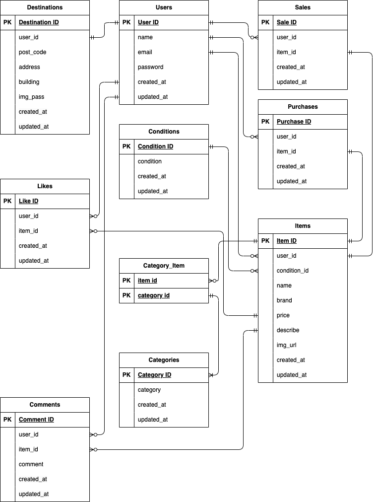

# アプリケーション名
お問い合わせフォーム

## 環境構築

Dockerビルド

	1. `git clone git@github.com:StrawberryFairyPrincess/flea-market_mock.git`
	2. `docker-compose up -d --build`


Laravel環境構築

	1. `docker-compose exec php bash`
	2. `composer install`
	3. .env.exampleファイルをコピーして.envを作成
	4. .envに以下の環境変数を追加
		``` text
		DB_CONNECTION=mysql
		DB_HOST=mysql
		DB_PORT=3306
		DB_DATABASE=laravel_db
		DB_USERNAME=laravel_user
		DB_PASSWORD=laravel_pass
		```
	5. アプリケーションキーの作成
		``` bash
		php artisan key:generate
		```
	6. マイグレーションの実行
		``` bash
		php artisan migrate
		```
	7. シーディングの実行
		``` bash
		php artisan db:seed
		```


PHPUnit環境構築

	・1会員登録機能の会員登録画面はメール認証を行っており、認証後はFigmaで指定のプロフィール画面に遷移
	・11支払い方法選択機能についてはJavaScriptを使用したためDUSKでテストを実施

	1. MySQLにログイン
		``` bash
		docker exec -it (MySQLのコンテナID) bash
		```
	2. demo_testデータベースを作る
		MySQLコンテナからMySQLにrootユーザでログイン
			``` bash
			mysql -u root -p
			```
		docker-compose.ymlのMYSQL_ROOT_PASSWORD: rootを入力
			``` bash
			root
			```
		demo_testデータベースを作る
			``` bash
			CREATE DATABASE demo_test;
			```
		ログアウト
			``` bash
			exit
	3. .envファイルをコピーして.env.testingを作成
	4. .env.testingの以下の環境変数を変更
		``` text
		APP_ENV=test
		APP_KEY=
		DB_DATABASE=demo_test
		DB_USERNAME=root
		DB_PASSWORD=root
		```
	5. PHPコンテナにログイン
		```bash
		docker-compose exec php bash
		```
	6. アプリケーションキーの作成
		``` bash
		php artisan key:generate --env=testing
		```
	7. キャッシュ削除
		``` bash
		php artisan config:clear
		```
	8. テスト用テーブル作成
		``` bash
		php artisan migrate --env=testing
		```


DUSKインストール

	1.  PHPコンテナにログイン
		```bash
		docker-compose exec php bash
		```
	2. Duskパッケージをインストール
		```bash
		composer require --dev laravel/dusk
		```
	3. Duskをインストール
		```bash
		php artisan dusk:install
		```
	4. OSに合う最新バージョンのChrome Driverをインストール
		```bash
		php artisan dusk:chrome-driver
		```
	5. .envに追記
		```bash
		DUSK_DRIVER_URL="http://localhost:9515"
		```
	6. config/database.phpにテスト用DBの指定
		```bash
		'connections' => [
			'sqlite_testing' => [
				'driver' => 'sqlite',
				'database' => ':memory:',
				'prefix' => '',
			],
		],
		```
	7. tests/DuskTextCase.phpを編集
		テスト用データベースの設定
		```bash
		use Illuminate\Support\Facades\DB;

		public function setUp(): void
		{
			parent::setUp();
			DB::connection('sqlite_testing')->reconnect();
		}
		```

		インストール済みのChromeバージョンに合わせて自動的にDriverをダウンロード
		```bash
		public static function prepare(){
			if (! static::runningInSail()) {
				static::startChromeDriver(['--port=9515']);
			}
		}
		```

		カスタムオプション追加
		```bash
		protected function driver(){
			$options = (new ChromeOptions)->addArguments([
				'--disable-gpu',
				'--headless',
				'--window-size=1920,1080',
				'--no-sandbox',
				'--disable-dev-shm-usage',
			]);
		}
		```


## 使用技術(実行環境)

	・Laravel Framework 8.83.8
	・PHP 7.4.9
	・MySQL 8.0.26
	・nginx 1.21.1
	・Fortify 1.9
	・Stripe 17.3
	・PHPUnit 9.5.10
	・Dusk 6.25.2


## ER図




## URL

    ・開発環境：http://localhost/
    ・phpMyAdmin：http://localhost:8080/
