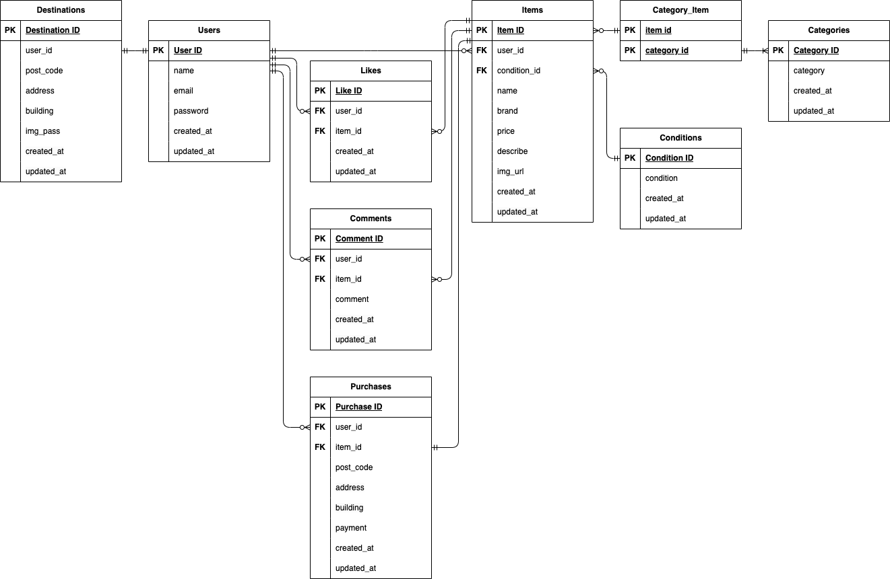

# アプリケーション名
お問い合わせフォーム

## 環境構築

Dockerビルド

	1. `git clone git@github.com:StrawberryFairyPrincess/flea-market_mock.git`
	2. `docker-compose up -d --build`


Laravel環境構築

	1. `docker-compose exec php bash`
	2. `composer install`
	3. .env.exampleファイルをコピーして.envを作成
	4. .envに以下の環境変数を追加
		``` text
		DB_CONNECTION=mysql
		DB_HOST=mysql
		DB_PORT=3306
		DB_DATABASE=laravel_db
		DB_USERNAME=laravel_user
		DB_PASSWORD=laravel_pass
		```
	5. アプリケーションキーの作成
		``` bash
		php artisan key:generate
		```
	6. マイグレーションの実行
		``` bash
		php artisan migrate
		```
	7. シーディングの実行
		``` bash
		php artisan db:seed
		```


画像フォルダのシンボリックリンク作成

	`php artisan storage:link`


Mailhogの設定

	.envの修正
		``` text
		MAIL_HOST=mailhog
		MAIL_PORT=1025
		MAIL_FROM_ADDRESS=info@flemarket.com
		MAIL_FROM_NAME=フリマ模擬案件
		```


Strype決済インストール

	1. Strype PHPライブラリインストール
		``` bash
		composer require stripe/stripe-php
		```
	2. アクセスキーを以下から
		https://dashboard.stripe.com/test/apikeys
	3. .envに2.で取得した公開可能キー、シークレットキーを追記
		``` text
		STRIPE_PUBLIC_KEY=(2.で取得した公開可能キー)
		STRIPE_SECRET_KEY=(2.で取得したシークレットキー)
		```
	4. キャッシュクリア
		``` bash
		php artisan config:clear
		php artisan cache:clear
		```


PHPUnit環境構築

	・1会員登録機能の会員登録画面はメール認証を行っており、認証後はFigmaで指定のプロフィール画面に遷移

	1. MySQLにログイン
		``` bash
		docker exec -it (MySQLのコンテナID) bash
		```
	2. demo_testデータベースを作る
		MySQLコンテナからMySQLにrootユーザでログイン
			``` bash
			mysql -u root -p
			```
		docker-compose.ymlのMYSQL_ROOT_PASSWORD: rootを入力
			``` bash
			root
			```
		demo_testデータベースを作る
			``` bash
			CREATE DATABASE demo_test;
			```
		ログアウト
			``` bash
			exit
	3. .envファイルをコピーして.env.testingを作成
	4. .env.testingの以下の環境変数を変更
		``` text
		APP_ENV=test
		APP_KEY=
		DB_DATABASE=demo_test
		DB_USERNAME=root
		DB_PASSWORD=root
		```
	5. PHPコンテナにログイン
		```bash
		docker-compose exec php bash
		```
	6. アプリケーションキーの作成
		``` bash
		php artisan key:generate --env=testing
		```
	7. キャッシュ削除
		``` bash
		php artisan config:clear
		```
	8. テスト用テーブル作成
		``` bash
		php artisan migrate --env=testing
		```


## 使用技術(実行環境)

	・Laravel Framework 8.83.8
	・PHP 7.4.9
	・MySQL 8.0.26
	・nginx 1.21.1
	・Fortify 1.9
	・Stripe 17.3
	・PHPUnit 9.5.10
	・Dusk 6.25.2


## ER図




## URL

    ・開発環境：http://localhost/
    ・phpMyAdmin：http://localhost:8080/
